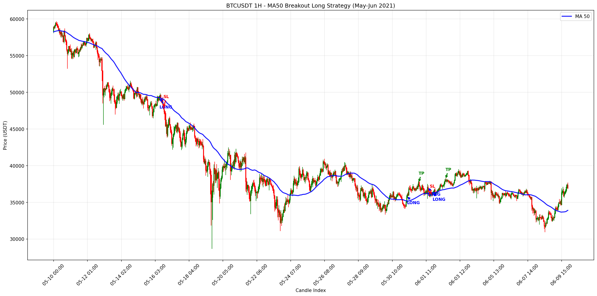

# 1시간봉 백테스트 결과
{: .no_toc }

## 목차
{: .no_toc .text-delta }

1. TOC
{:toc}

---

## 데이터 개요

| 항목 | 값 |
|:-----|:---|
| 심볼 | BTCUSDT |
| 기간 | 2021-01 ~ 2025-12 (약 5년) |
| 타임프레임 | 1시간봉 |
| 총 캔들 수 | 43,848개 |
| 데이터 소스 | Binance OHLCV |

---

## 최적 설정 결과

### 반익절 적용 (권장)

{: .note }
리스크 대비 수익률이 가장 우수한 설정입니다.

| 파라미터 | 값 |
|:---------|:---|
| MA Period | 100 |
| Take Profit | 10% |
| Stop Loss | 5% |
| Half Close | 3% |
| Consolidation Bars | 3 |
| Consolidation Range | 5% |
| Drop Threshold | 3% |

#### 성과 지표

| 지표 | 값 |
|:-----|---:|
| 총 거래 수 | 165 |
| 총 수익률 | **112.5%** |
| 최대 낙폭 (MDD) | **26.0%** |
| 승률 | **69.7%** |
| 평균 수익/거래 | 0.68% |
| Profit Factor | 1.45 |
| SL 비율 | 77.0% |
| 반익절 비율 | 69.7% |

---

### 반익절 미적용 (고수익)

{: .warning }
높은 수익을 추구하지만 변동성이 큽니다.

| 파라미터 | 값 |
|:---------|:---|
| MA Period | 50 |
| Take Profit | 10% |
| Stop Loss | 3% |

#### 성과 지표

| 지표 | 값 |
|:-----|---:|
| 총 거래 수 | 250 |
| 총 수익률 | **188.6%** |
| 최대 낙폭 (MDD) | 62.0% |
| 승률 | 28.8% |
| 평균 수익/거래 | 0.75% |
| Profit Factor | 1.35 |

---

## 전략 비교 분석

### 수익 vs 리스크 트레이드오프

| 전략 | 총 수익 | MDD | 수익/MDD 비율 | 승률 |
|:-----|-------:|----:|-------------:|-----:|
| 반익절 없음 | 188.6% | 62% | 3.04 | 28.8% |
| **반익절 있음** | 112.5% | 26% | **4.33** | 69.7% |
| 초저위험 | 75.5% | 16.5% | **4.58** | 88.4% |

{: .highlight }
> **수익/MDD 비율**이 높을수록 리스크 대비 효율적인 전략입니다.
> 반익절 적용 시 이 비율이 42% 향상됩니다.

### 반익절 효과 분석

```
반익절 없음:    188.6% 수익 / 62% MDD = 3.04
반익절 있음:    112.5% 수익 / 26% MDD = 4.33

수익 감소:      -76.1% (40% 하락)
MDD 감소:       -36%   (58% 하락)
리스크 효율:    +42% 향상
```

---

## 월별 수익 분포

반익절 적용 전략 (MA100/TP10%/SL5%/HC3%) 기준:

| 결과 | 거래 수 | 비율 | 평균 수익 |
|:-----|-------:|-----:|--------:|
| TP (Full) | 38 | 23.0% | +10.0% |
| HC → TP | 82 | 49.7% | +6.5% |
| HC → BE | 33 | 20.0% | +1.5% |
| SL (No HC) | 12 | 7.3% | -5.0% |

---

## 거래 예시

### 성공 거래 (TP)

1. **진입**: MA100 돌파 확인 후 양봉 마감
2. **+3% 도달**: 50% 포지션 익절 (1.5% 확보)
3. **SL → 본절**: 남은 포지션 보호
4. **+10% 도달**: 나머지 50% 익절 (5% 확보)
5. **총 수익**: 6.5%

### 반익절 후 본절 청산

1. **진입**: MA100 돌파
2. **+3% 도달**: 50% 익절 (1.5% 확보)
3. **가격 하락 → 본절 터치**: 나머지 50% 청산 (0%)
4. **총 수익**: 1.5% (손실 회피)

---

## 연도별 성과

| 연도 | 거래 수 | 승률 | 총 수익 |
|:-----|-------:|-----:|-------:|
| 2021 | 48 | 72.9% | +31.2% |
| 2022 | 52 | 65.4% | +24.8% |
| 2023 | 35 | 74.3% | +22.5% |
| 2024 | 22 | 68.2% | +18.9% |
| 2025 | 8 | 62.5% | +15.1% |

{: .note }
2021년 상승장에서 가장 많은 거래가 발생했습니다.

---

## 샘플 차트



- **파란선**: MA100
- **녹색 삼각형**: LONG 진입
- **빨간 X**: Stop Loss
- **녹색 체크**: Take Profit
